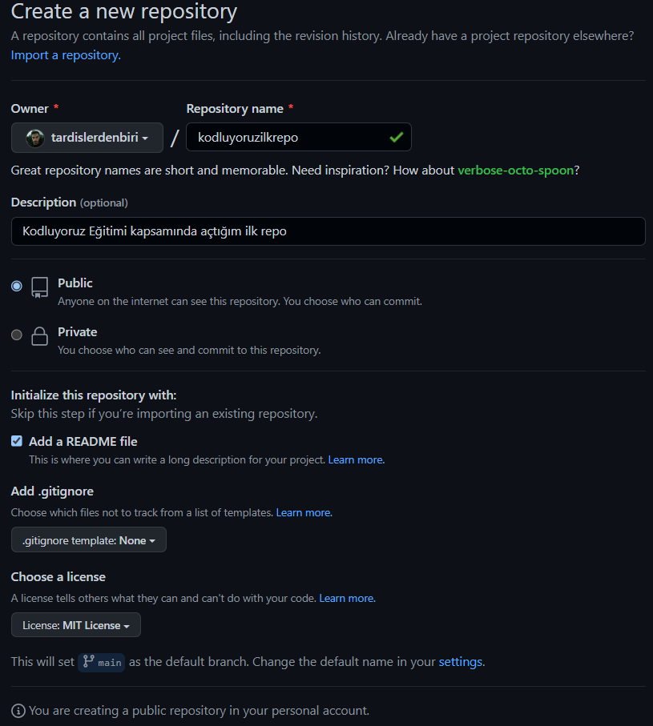

# Kodluyoruz İlk Repo
Bu Repo [Kodluyoruz](https://kodluyoruz.org) Front-End Eğitiminde oluşturduğumuz ilk repo. İçerisinde bir adet README dosyası, bir adet de index.html barındırıyor.

## Installation
Öncelikle projeyi clonelayın. (Buraya sizin reponuzdan aldığınız link gelecek.)

`git clone https://github.com/tardislerdenbiri/kodluyoruzilkrepo.git`

## Usage
Projeyi cloneladıktan sonra Visual Studio Code programını açınız.
  
Linux için: 
`cd kodluyoruzilkrepo` 
`code .`
 

## Contributing
Pull Request'ler kabul edilir. Büyük değişiklikler için, lütfen önce neyi değiştirmek istediğinizi tartışmak için bir konu açınız.

